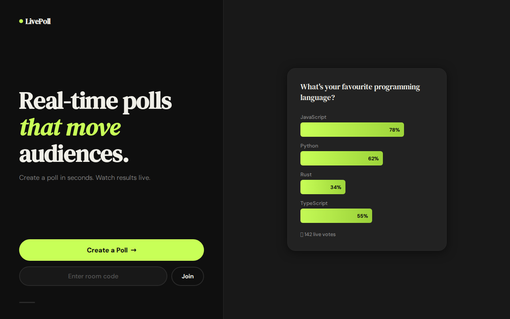

<div align="center">

# ⚡ LivePoll

[](https://alfredang.github.io/livepoll/)
[](https://developer.mozilla.org/en-US/docs/Web/HTML)
[](https://developer.mozilla.org/en-US/docs/Web/CSS)
[](https://developer.mozilla.org/en-US/docs/Web/JavaScript)
[](https://firebase.google.com)
[](LICENSE)

**Real-time interactive polling for audiences, classrooms & events.**

[Live Demo](https://alfredang.github.io/livepoll/) · [Report Bug](https://github.com/alfredang/livepoll/issues) · [Request Feature](https://github.com/alfredang/livepoll/issues)

</div>

---

## Screenshot

<!--  -->

> 🌐 **[Try it live →](https://alfredang.github.io/livepoll/)**

---

## About

**LivePoll** is a Mentimeter-inspired live polling platform that lets hosts create interactive polls and audiences respond in real-time. Watch bar charts animate live as votes come in. Join with a 6-digit room code or QR scan. Zero setup for participants — just open the link.

---

## ✨ Features

| Feature | Description |
|---------|-------------|
| 🎯 **Live Voting** | Real-time results update as participants vote |
| 🔢 **Room Codes** | Join with a 6-digit code or scan QR |
| 📊 **Animated Charts** | Smooth bar chart animations on every vote |
| 📱 **Mobile-First** | Fully responsive — works on any device |
| 🎨 **Bold Design** | Editorial dark theme with electric lime accent |
| 🔗 **URL Join** | Share a direct link `?join=123456` |
| 🧭 **Multi-Question** | Create polls with multiple questions |
| 👥 **Live Presence** | See participant count in real-time |
| ✅ **Answer Highlight** | Your choice highlighted in results |

---

## 🕹️ How to Use

### As a Host
1. Click **"Create a Poll"**
2. Enter your poll title and add questions with options
3. Click **"Launch Poll"** — get a room code + QR
4. Share the code with your audience
5. Click **"Start Poll"** when ready
6. Click **"Show Results"** to reveal votes, **"Next →"** for the next question

### As a Participant
1. Go to the live URL or enter the room code
2. Wait for the host to start
3. Tap your answer — see live results after the host reveals them

---

## 📁 File Structure

```
livepoll/
├── index.html                  # Single-page app shell (all screens)
├── css/
│   └── style.css               # DM Sans + DM Serif Text, dark editorial theme
├── js/
│   ├── config.js               # Firebase configuration
│   ├── sync.js                 # Firebase real-time wrapper
│   ├── poll.js                 # Poll CRUD & vote logic
│   ├── charts.js               # Animated bar chart renderer
│   └── app.js                  # Screen management & event handling
├── tests/
│   └── test_livepoll.py        # Playwright E2E test suite (24 tests)
├── .github/
│   └── workflows/
│       └── deploy.yml          # GitHub Actions → GitHub Pages
├── CLAUDE.md                   # AI agent project commands
└── README.md
```

---

## 🚀 Tech Stack

| Layer | Technology |
|-------|-----------|
| **Frontend** | HTML5, CSS3, Vanilla JavaScript (ES6+) |
| **Real-time** | Firebase Realtime Database |
| **Typography** | DM Serif Text + DM Sans (Google Fonts) |
| **QR Codes** | QRCode.js (CDN) |
| **Testing** | Playwright (Python) |
| **CI/CD** | GitHub Actions |
| **Hosting** | GitHub Pages |

---

## 🛠️ Local Development

```bash
git clone https://github.com/alfredang/livepoll.git
cd livepoll

# Serve locally
python3 -m http.server 8080
# or: npx serve -l 8080

# Open http://localhost:8080
```

### Running Tests

```bash
pip install playwright
playwright install chromium

python3 .claude/test-app/scripts/with_server.py \
  --server "python3 -m http.server 8080" --port 8080 \
  -- python3 tests/test_livepoll.py
```

---

## 🔥 Firebase Setup

1. Create a project at [Firebase Console](https://console.firebase.google.com)
2. Add a Web App → copy the config into `js/config.js`
3. Enable **Realtime Database** → Start in test mode
4. Deploy and you're live!

---

## 🤖 Acknowledgements

Built with [OpenClaw](https://openclaw.ai) — AI-powered personal agent platform.

Inspired by [Mentimeter](https://mentimeter.com).

---

## 📄 License

MIT
